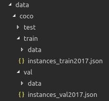

# MobileNetV3

A tensorflow implementation of the paper "Searching for MobileNetV3" with a R-ASPP segmenter head and classification head.

This project is in active development and as such, has a lot of rough edges. The implementation should be true to the original paper, but your mileage may vary.

## Installation

`pip install -r requirements.txt`

## Results

The implementation was initially done to apply the MobileNet v3 architecture to skin lesion segmentation, as per the [ISIC Challenge 2018](https://challenge2018.isic-archive.com/). The 2018 edition was chosen as it is the last one with a segmentation task.

## Metrics

For segmentation, two metrics are availables, namely Dice Coefficient and Jaccard Index. In both cases a matching loss is also provided.

## Optimizers

The original paper used RMSProp, but we found out that training could be sped up by using Adam instead.

## Train from scratch

### COCO

You can download the files [here](http://cocodataset.org/#download).

Once that's done, create this hierarchy in your directories:

You should be able to run it with `python3 train.py`

### ISIC 2018

You can download the dataset [here](https://challenge2018.isic-archive.com/).

TODO

## Evaluation

### Segmentation 

**To get predictions for one image**

Run `python3 eval.py --model-path out/ -i your_image.png` to output the segmentation mask.

**To get predictions for multiple images**

TODO

### Classification

**To get predictions for one image**

TODO

**To get predictions for multiple images**

Run `python3 eval_classification.py --model-path out/ --input-dir your_test_dir/ --labels-file labels.csv` to output the confusion matrix.
